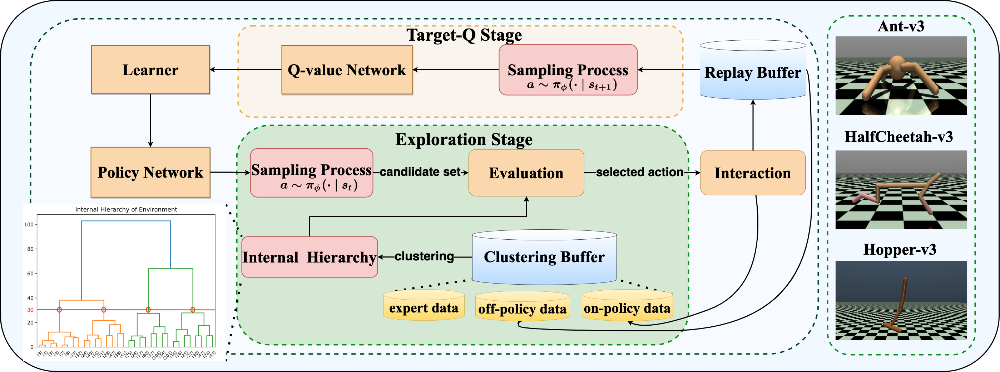
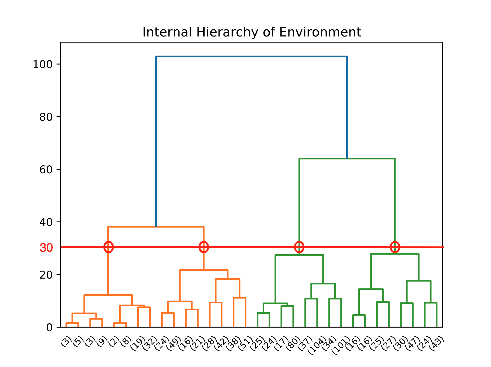
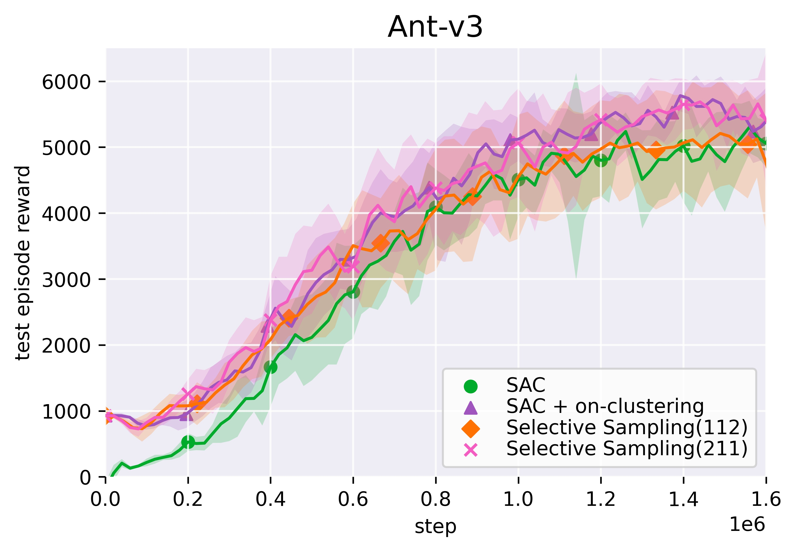
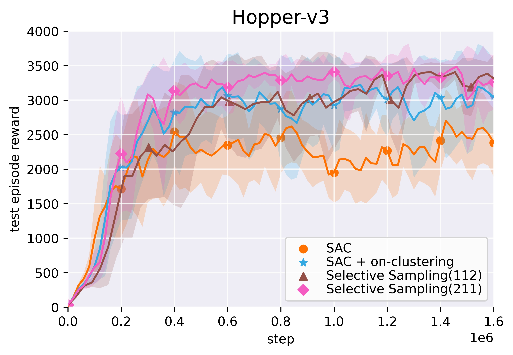
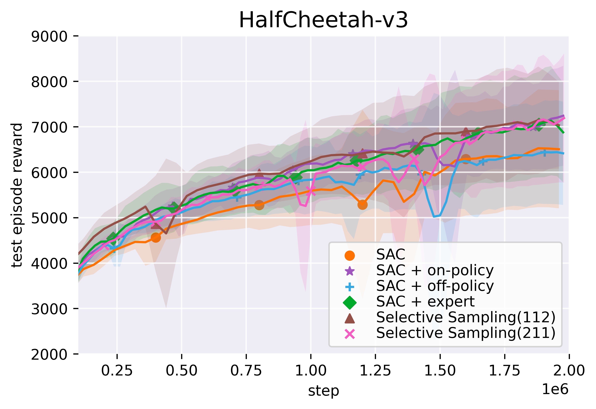
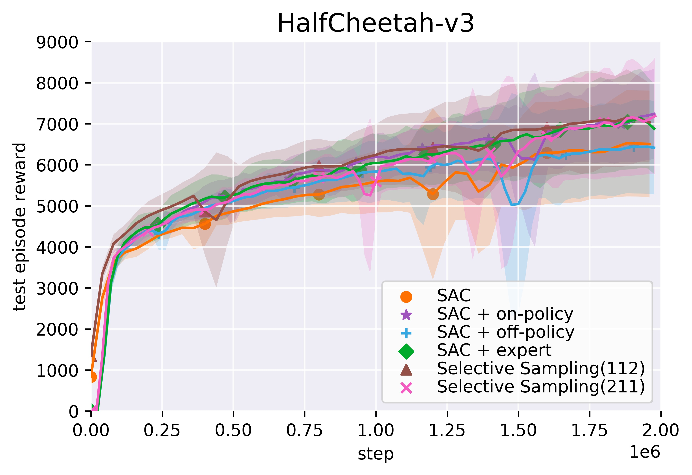
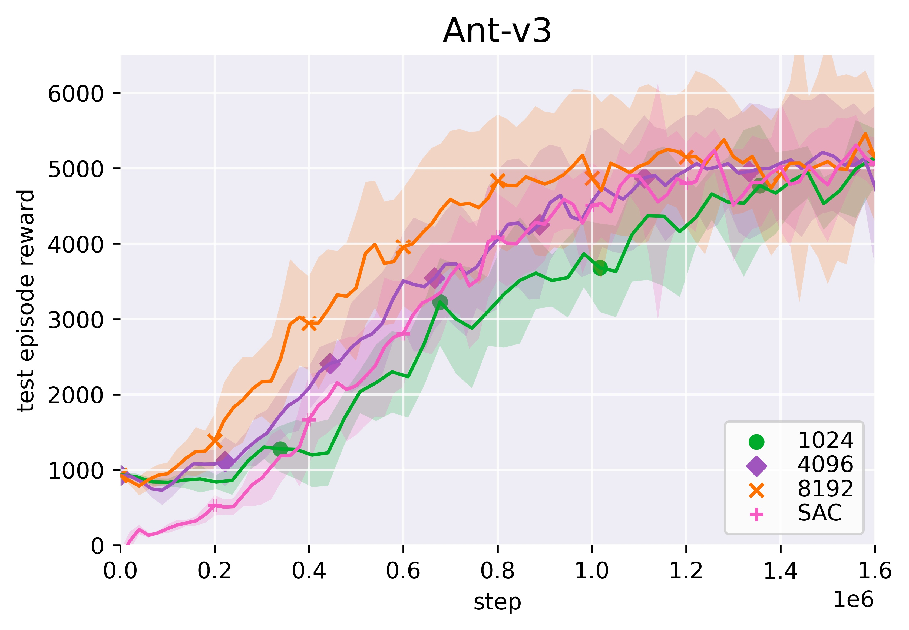

# SelectiveSampling
## Algorithm Design

  

## Internal Hierarchy：Diversity of clustering buffer

  

## Add on-clustering on Ant & Hopper

  
  

## More clearly results of Halfcheetah

    
    

# Ablation study of sampling size on clustring buffer

  

# Overall 

 

